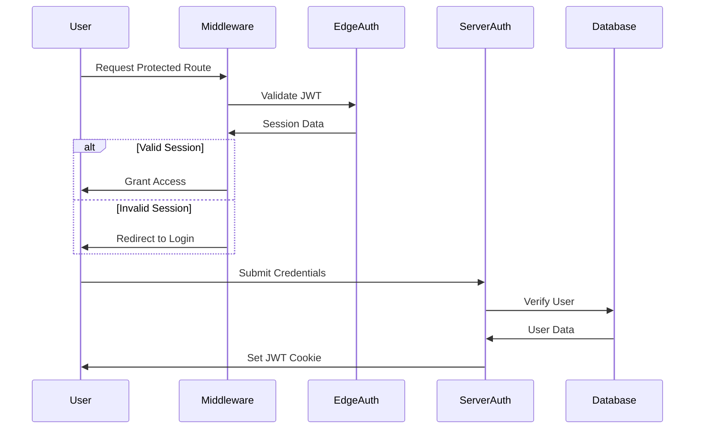
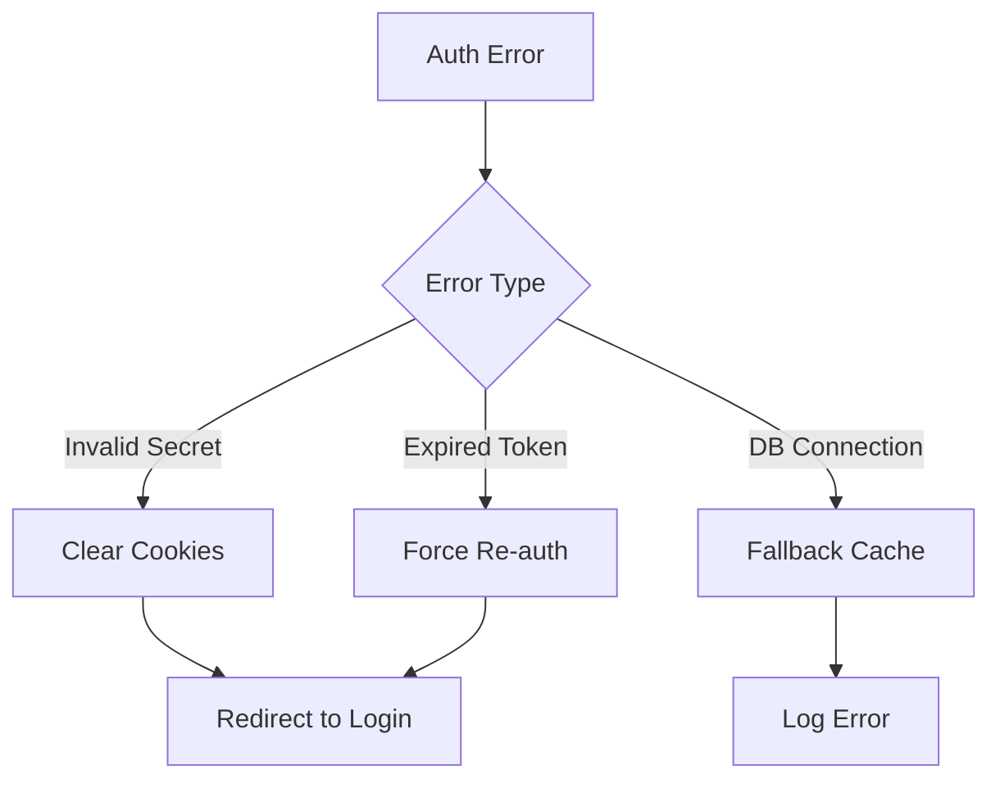

# NextAuth Workflow Documentation

## Authentication Flow Diagram



## Core Workflow Components

### 1. Edge Runtime Flow (Middleware)

```typescript
// Simplified Edge Auth Check
export const edgeAuthConfig = {
  callbacks: {
    jwt: ({ token, user }) => ({
      id: user?.id, // From credential validation
      role: user?.role, // From database
    }),
    session: ({ session, token }) => ({
      user: {
        id: token.id, // Passed to middleware
        role: token.role, // For RBAC checks
      },
    }),
  },
};
```

### 2. Server-Side Flow (API Routes)

```typescript
// Full Auth Configuration
export const authConfig = {
  adapter: PrismaAdapter(prisma), // DB operations
  providers: [
    CredentialsProvider({
      authorize: async (credentials) => {
        // Full credential validation
        const user = await prisma.user.findUnique(...);
        return user;
      }
    })
  ]
}
```

## Type Safety Implementation

```typescript
// Extended Type Definitions
declare module 'next-auth' {
  interface User {
    id: string;
    role: 'user' | 'admin' | 'editor';
  }
  interface Session {
    user: {
      id: string;
      role: string;
    };
  }
}

// JWT Type Guards
interface CustomJWT extends JWT {
  id: string;
  role: string;
}
```

## Security Implementation Table

| Security Layer        | Implementation Details                  |
| --------------------- | --------------------------------------- |
| Credential Validation | Zod schema + bcrypt password comparison |
| Session Encryption    | AES-256-CBC with NEXTAUTH_SECRET        |
| RBAC Enforcement      | Middleware + rolePermissions matrix     |
| CSRF Protection       | NextAuth built-in CSRF tokens           |
| Brute Force Defense   | Prisma-based login attempt tracking     |

## Secret Management Strategy

```bash
# Secret Rotation Process
1. Generate new secret: openssl rand -base64 32
2. Update .env.production: NEXTAUTH_SECRET_NEW=<new-secret>
3. Modify auth config:
secret: [process.env.NEXTAUTH_SECRET_NEW, process.env.NEXTAUTH_SECRET]
4. Deploy and monitor
5. Remove old secret after 72h
```

## Error Recovery Guide

### Common JWT Errors

```typescript
// JWT Error Handling Pattern
try {
  await auth();
} catch (error) {
  if (error instanceof JWSError) {
    // Handle invalid signature
    redirect('/login?error=invalid_session');
  }
  if (error instanceof JWTExpired) {
    // Handle expired token
    redirect('/login?error=session_expired');
  }
}
```

### Middleware Error Recovery



## Performance Optimization

### Cache Strategy

```typescript
// Session Cache Example
const sessionCache = new LRUCache<string, Session>({
  max: 1000, // Max cached sessions
  ttl: 1000 * 60 * 5, // 5 minutes
});

export async function getCachedSession() {
  const session = await auth();
  sessionCache.set(session.user.id, session);
  return session;
}
```

### Edge Performance Metrics

```typescript
// Middleware Metrics
export default auth((req) => {
  const start = Date.now();
  // ... auth logic ...
  const duration = Date.now() - start;

  metrics.timing('middleware.auth', duration);
  metrics.increment('middleware.requests');
});
```

This documentation provides a complete view of the authentication system with:

1. Visual workflow diagrams
2. Type-safe implementation details
3. Security best practices
4. Error recovery patterns
5. Performance optimization strategies
