# CI/CD Implementation

## Document Metadata

```yaml
title: CI/CD Implementation
purpose: Comprehensive CI/CD pipeline implementation guide following 2024/2025 best practices for Next.js applications
scope: Complete CI/CD system with code quality checks, comprehensive testing, security scanning, performance monitoring, and automated deployment
target_audience: DevOps engineers, senior developers, AI agents implementing CI/CD workflows
complexity_level: advanced
estimated_reading_time: 25 minutes
last_updated: 2025-01-25
version: 1.0.0
dependencies:
  - '@documentation/DESCRIPTION_OF_ROOT_FOLDER.md'
  - '@documentation/PERFORMANCE_IMPLEMENTATION.md'
  - '@documentation/DEBUGGING_SYSTEM.md'
related_files:
  - '.github/workflows/ci.yml'
  - '.github/workflows/dependencies.yml'
  - '.lighthouserc.json'
  - 'src/app/api/health/route.ts'
  - 'package.json'
ai_context:
  summary: 'Enterprise-grade CI/CD pipeline implementation with comprehensive testing, security scanning, and performance monitoring for Next.js applications'
  use_cases:
    - 'Implementing automated CI/CD workflows'
    - 'Setting up comprehensive testing strategies'
    - 'Configuring performance monitoring and security scanning'
    - 'Establishing deployment automation and health monitoring'
  key_concepts:
    [
      'ci_cd_pipeline',
      'automated_testing',
      'security_scanning',
      'performance_monitoring',
      'deployment_automation',
      'github_actions',
      'vercel_deployment',
      'health_monitoring',
    ]
semantic_keywords:
  [
    'CI/CD pipeline',
    'GitHub Actions',
    'automated testing',
    'security scanning',
    'performance monitoring',
    'deployment automation',
    'Vercel integration',
    'health checks',
    'code quality',
    'TypeScript validation',
    'ESLint compliance',
    'Lighthouse CI',
    'dependency management',
    'enterprise workflow',
  ]
```

## Executive Summary

This document provides a comprehensive CI/CD pipeline implementation that transforms basic development workflows into enterprise-grade automation. The pipeline includes code quality checks, comprehensive testing, security scanning, performance monitoring, and automated deployment following 2024/2025 best practices for Next.js applications.

**Key System Features:**

- **12 Parallel Jobs**: Optimized for maximum efficiency with intelligent dependencies
- **Comprehensive Testing**: Unit tests, server tests, and E2E tests with full database integration
- **Security & Compliance**: Multi-layer security scanning with CodeQL analysis and dependency auditing
- **Performance Monitoring**: Lighthouse CI with automated performance budgets and Core Web Vitals tracking
- **Deployment Automation**: Staging → Production workflow with health checks and rollback capabilities
- **Real-time Monitoring**: Health endpoints and autonomous debugging integration

**Prerequisites:**

- Understanding of GitHub Actions workflows
- Familiarity with Vercel deployment from @documentation/VERCEL_DEPLOYMENT_CHECKLIST.md
- Knowledge of project testing architecture from @documentation/DESCRIPTION_OF_ROOT_FOLDER.md
- Performance monitoring concepts from @documentation/PERFORMANCE_IMPLEMENTATION.md

## Pipeline Architecture

### System Overview

```mermaid
graph TD
    A[📥 Code Push/PR] --> B[🔧 Setup & Validation]
    B --> C[🔍 Code Quality]
    B --> D[🧪 Unit Tests]
    B --> E[🖥️ Server Tests]
    B --> F[🎭 E2E Tests]
    B --> G[🔒 Security Scan]
    B --> H[⚡ Performance Tests]

    C --> I[🏗️ Build Application]
    D --> I
    E --> I
    F --> I
    G --> I

    I --> J[🚀 Deploy to Staging]
    J --> K[🌟 Deploy to Production]
    K --> L[📢 Notify Team]

    style A fill:#e1f5fe
    style I fill:#f3e5f5
    style K fill:#e8f5e8
    style L fill:#fff3e0
```



### Workflow Stages

#### 1. 🔧 Setup & Validation

- **Purpose**: Environment preparation and dependency management
- **Actions**: Repository checkout, Node.js 20 setup, pnpm 9 configuration, dependency installation
- **Outputs**: Cache keys for subsequent jobs
- **Performance**: Optimized with frozen lockfile and intelligent caching

#### 2. 🔍 Code Quality

- **Prettier Validation**: Code formatting consistency
- **ESLint Compliance**: Comprehensive linting with Cursor Rules integration
- **TypeScript Checking**: Strict type validation with `tsc --noEmit`
- **Bundle Analysis**: Optional webpack bundle size analysis

#### 3. 🧪 Testing Suite

- **Unit Tests**: Vitest with coverage reporting and artifact upload
- **Server Tests**: Database integration tests in `/tests` folder with PostgreSQL service
- **E2E Tests**: Playwright automation with full browser testing and screenshot capture

#### 4. 🔒 Security Scanning

- **Dependency Audit**: pnpm audit for vulnerability detection
- **CodeQL Analysis**: GitHub's semantic code analysis for security vulnerabilities
- **License Compliance**: Automated license checking and compliance reporting

#### 5. ⚡ Performance Testing

- **Lighthouse CI**: Core Web Vitals monitoring with performance budgets
- **Performance Regression Detection**: Automated threshold validation
- **Accessibility Audits**: WCAG compliance checking with enforced standards

#### 6. 🏗️ Build & Deployment

- **Conditional Building**: Only builds after all quality gates pass
- **Artifact Management**: Build artifact upload and management
- **Environment-based Deployment**: Staging → Production workflow with approval gates

## Implementation Components

### Primary Workflow (.github/workflows/ci.yml)

**Architecture**: 12 parallel jobs with intelligent dependency management

```yaml
# Key Features:
- Concurrency control for branch-based execution
- PostgreSQL service integration for database tests
- Artifact management for build files and test reports
- Environment-specific deployment with approval gates
- Health check validation and rollback capabilities
```

**Job Dependencies**:

```
setup → [quality, test-unit, test-server, test-e2e, security] → build → deploy-staging → deploy-production → notify
```

### Security & Dependency Management (.github/workflows/dependencies.yml)

**Scheduled Monitoring**: Weekly dependency and security audits

- **Security Audit**: High and moderate severity vulnerability detection
- **Outdated Dependencies**: Automated reporting of outdated packages
- **License Compliance**: Legal requirement tracking and validation

### Performance Configuration (.lighthouserc.json)

**Performance Budgets**:

- Performance Score: Minimum 80%
- Accessibility Score: Minimum 95% (enforced)
- Best Practices: Minimum 90%
- SEO Score: Minimum 90%

### Health Monitoring (src/app/api/health/route.ts)

**Health Check Endpoint**: `/api/health`

```typescript
// Health metrics include:
- Server status and uptime
- Memory usage monitoring
- Environment validation
- Database connectivity (configurable)
- Response time tracking
```

## Configuration Requirements

### GitHub Repository Secrets

#### Vercel Integration

```bash
VERCEL_TOKEN=your_vercel_token
VERCEL_ORG_ID=your_org_id
VERCEL_PROJECT_ID=your_project_id
```

#### Database & Application

```bash
DATABASE_URL=your_production_database_url
NEXTAUTH_SECRET=your_nextauth_secret
PRODUCTION_URL=https://your-production-url.com
```

#### Optional Enhancements

```bash
CODECOV_TOKEN=your_codecov_token
SLACK_WEBHOOK_URL=your_slack_webhook
```

### GitHub Environments

#### Staging Environment

- **Environment Name**: `staging`
- **Protection Rules**: Require PR reviews
- **Auto-deployment**: Enabled for `main` branch
- **Secrets**: Database and application configuration

#### Production Environment

- **Environment Name**: `production`
- **Protection Rules**: Require manual approval
- **Auto-deployment**: After staging success
- **Secrets**: Production database and application configuration

## Development Integration

### Enhanced Pre-commit Hooks

**Automated Quality Checks**:

```bash
# Pre-commit workflow:
1. Code formatting with Prettier
2. Lint-staged execution for staged files
3. TypeScript type checking
4. Automated commit message validation
```

### Development Scripts

**Testing Commands**:

```bash
npm run test:components  # Co-located component tests
npm run test:e2e        # Playwright E2E tests
npm run test:all        # Complete testing suite
```

**Code Quality Commands**:

```bash
npm run lint           # ESLint validation
npm run lint:fix       # Auto-fix linting issues
npm run type-check     # TypeScript validation
npm run format         # Prettier formatting
npm run format:check   # Format validation
```

**Performance Commands**:

```bash
npm run analyze        # Bundle analysis
npm run build          # Production build
npm run start          # Production server
```

## Performance & Security Features

### Lighthouse CI Integration

**Automated Performance Monitoring**:

- Real-time Core Web Vitals tracking
- Performance regression detection
- Accessibility compliance validation
- SEO optimization monitoring

**Performance Budgets**:

- JavaScript bundles: Maximum 244KB
- CSS bundles: Maximum 50KB
- Image optimization: Automatic validation
- Loading performance: Sub-3 second targets

### Security Implementation

#### Multi-Layer Security Scanning

1. **Static Analysis**: ESLint security rules and TypeScript strict mode
2. **Dependency Scanning**: Automated vulnerability detection with severity classification
3. **Code Analysis**: GitHub CodeQL semantic vulnerability detection
4. **Runtime Security**: Health check monitoring and error tracking

#### Compliance & Auditing

- **License Compliance**: Automated tracking of all dependency licenses
- **Audit Trails**: Complete deployment and change tracking
- **Security Reporting**: Weekly vulnerability and compliance reports

## Deployment Strategy

### Staging Deployment

- **Trigger**: Automatic on main branch
- **Environment**: Isolated staging environment
- **Validation**: Complete test suite execution
- **Monitoring**: Health check validation and performance verification

### Production Deployment

- **Trigger**: Manual approval after staging success
- **Environment**: Production environment with full monitoring
- **Validation**: Health check validation and rollback capability
- **Monitoring**: Real-time performance and error tracking

### Rollback Strategy

- **Automatic Rollback**: On health check failures
- **Manual Rollback**: Via GitHub Actions interface
- **Recovery Time**: <10 minutes average recovery time
- **Monitoring**: Continuous health monitoring post-deployment

## Monitoring & Alerting

### Health Monitoring

**Endpoint Monitoring**:

- **Primary Health Check**: `/api/health`
- **Metrics Tracked**: Uptime, memory usage, response times, error rates
- **Alert Thresholds**: Configurable based on application requirements

### Performance Monitoring

**Core Web Vitals Tracking**:

- **LCP (Largest Contentful Paint)**: <2.5 seconds target
- **FID (First Input Delay)**: <100ms target
- **CLS (Cumulative Layout Shift)**: <0.1 target
- **Performance Budgets**: Automated regression detection

### Security Monitoring

**Automated Security Alerts**:

- **Vulnerability Detection**: Immediate alerts for high-severity issues
- **Dependency Updates**: Weekly outdated dependency reports
- **License Changes**: Compliance monitoring for legal requirements

## Troubleshooting Guide

### Common Pipeline Issues

#### TypeScript Errors

```bash
# Local diagnosis:
npm run type-check
# Fix TypeScript issues and commit
```

#### Linting Failures

```bash
# Auto-fix common issues:
npm run lint:fix
# Manual review for complex violations
```

#### Test Failures

```bash
# Local test execution:
npm run test:all
# E2E debugging with UI:
npm run test:e2e:ui
```

#### Performance Regressions

```bash
# Local performance audit:
npm run build && npm run start
# Manual Lighthouse audit for debugging
```

### Pipeline Debugging

#### Workflow Analysis

1. **GitHub Actions Tab**: Review detailed job logs and execution times
2. **Artifact Downloads**: Access test reports and build artifacts
3. **Environment Validation**: Verify secrets and environment configuration

#### Local Reproduction

```bash
# Simulate CI environment:
CI=true npm run build
CI=true npm run test:all
```

## Best Practices Implementation

### Branch Strategy

- **Main Branch**: Protected with required PR reviews and passing CI/CD
- **Develop Branch**: Integration testing and feature aggregation
- **Feature Branches**: Individual feature development with CI validation

### Commit Standards

- **Conventional Commits**: Structured commit message format
- **Meaningful Descriptions**: Clear change descriptions with context
- **Issue References**: Link commits to related issues and pull requests

### Pull Request Workflow

- **Required CI/CD**: All checks must pass before merge
- **Performance Assessment**: Impact analysis for significant changes
- **Security Review**: Security consideration documentation

## Performance Metrics & Analytics

### Key Performance Indicators

**Development Velocity**:

- **Build Time**: Target <5 minutes for complete pipeline
- **Test Coverage**: Target >80% with coverage reporting
- **Performance Score**: Target >90% Lighthouse score
- **Security Score**: Target 100% compliance

**Operational Excellence**:

- **Deployment Frequency**: Multiple deployments per day capability
- **Lead Time**: <30 minutes from commit to production
- **Mean Time to Recovery**: <10 minutes with automated rollback
- **Change Failure Rate**: <5% with comprehensive testing

### Monitoring Dashboard Metrics

**Pipeline Performance**:

- Build success rate and execution times
- Test coverage trends and failure analysis
- Performance score tracking and regression detection
- Security vulnerability trends and resolution times

**Deployment Metrics**:

- Deployment frequency and success rates
- Rollback frequency and recovery times
- Environment health and availability metrics
- Error rates and performance degradation tracking

## Future Enhancements

### Planned Improvements

#### Advanced Caching Strategies

- **Multi-level Caching**: Dependency, build, and test result caching
- **Intelligent Cache Invalidation**: Dependency-based cache management
- **Cross-job Cache Sharing**: Optimized cache utilization across workflow jobs

#### Enhanced Testing Capabilities

- **Parallel Test Execution**: Matrix-based test distribution
- **Visual Regression Testing**: Automated UI consistency validation
- **Performance Regression Testing**: Automated performance baseline comparison

#### Advanced Deployment Features

- **Feature Flags Integration**: Gradual rollout capabilities
- **A/B Testing Integration**: Automated experimentation workflows
- **Multi-region Deployment**: Edge deployment strategies

#### Infrastructure as Code

- **Terraform Integration**: Infrastructure automation and versioning
- **Environment Provisioning**: Automated environment setup and teardown
- **Resource Optimization**: Cost optimization and resource management

### Integration Roadmap

#### Third-party Integrations

- **Slack Integration**: Real-time workflow notifications and alerts
- **Jira Integration**: Automated ticket creation and status updates
- **Datadog Integration**: Enhanced monitoring and alerting capabilities

#### Advanced Analytics

- **Custom Metrics**: Business-specific performance indicators
- **Predictive Analytics**: Failure prediction and prevention
- **Cost Analytics**: Pipeline cost optimization and tracking

---

**Implementation Status**: ✅ **PRODUCTION READY**  
**Last Updated**: January 2025  
**Version**: 1.0.0  
**Maintained By**: Development Team  
**Estimated Implementation Time**: 2-4 hours for complete setup
