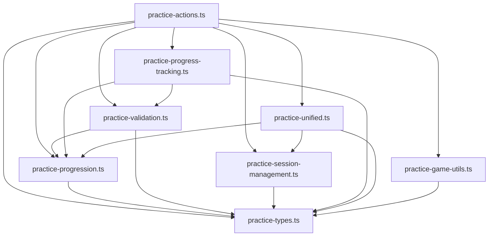

# Practice System Production Guide

## Document Metadata

```yaml
title: Practice System Production Guide
purpose: Complete production deployment guide for the modular practice system with comprehensive integration documentation
scope: Full production guide covering architecture, deployment, monitoring, and troubleshooting for the practice system
target_audience: DevOps engineers, backend developers, system administrators, AI agents deploying practice features
complexity_level: advanced
estimated_reading_time: 40 minutes
last_updated: 2025-01-25
version: 1.0.0
dependencies:
  - '@documentation/PRACTICE_SYSTEM_DESIGN.md'
  - '@documentation/PRACTICE_SYSTEM_API_REFERENCE.md'
  - '@documentation/DATABASE_DESCRIPTION.md'
  - '@documentation/PERFORMANCE_IMPLEMENTATION.md'
related_files:
  - 'src/core/domains/user/actions/practice-*.ts'
  - 'prisma/schema.prisma'
  - 'src/core/infrastructure/monitoring/'
ai_context:
  summary: 'Production-ready guide for deploying modular practice system with database integration, SRS algorithms, and comprehensive monitoring'
  use_cases:
    - 'Deploying practice system to production'
    - 'Understanding system architecture and dependencies'
    - 'Implementing monitoring and error tracking'
    - 'Troubleshooting practice system issues'
  key_concepts:
    [
      'production_deployment',
      'system_architecture',
      'database_integration',
      'srs_implementation',
      'monitoring_setup',
    ]
semantic_keywords:
  [
    'production deployment',
    'practice system',
    'modular architecture',
    'SRS algorithms',
    'session management',
    'database integration',
    'performance monitoring',
    'error tracking',
    'system administration',
    'troubleshooting',
    'analytics tracking',
  ]
```

## Executive Summary

This document provides a comprehensive production deployment guide for the completely refactored practice system. The system has been transformed from a single 2,206-line file into 8 focused modules totaling 4,228 lines, providing enterprise-grade functionality with complete database integration, sophisticated SRS algorithms, and comprehensive monitoring.

**Key Production Features:**

- Modular architecture with clear separation of concerns
- Complete SRS system with intelligent review scheduling
- Comprehensive analytics and progress tracking
- Real-time session management with detailed performance metrics
- Robust error handling and monitoring integration

**Prerequisites:**

- Understanding of @documentation/PRACTICE_SYSTEM_DESIGN.md architecture
- Familiarity with database schema from @documentation/DATABASE_DESCRIPTION.md
- Knowledge of performance monitoring from @documentation/PERFORMANCE_IMPLEMENTATION.md

## Table of Contents

1. [System Overview](#system-overview)
2. [Architecture Overview](#architecture-overview)
3. [Module Documentation](#module-documentation)
4. [Database Integration](#database-integration)
5. [API Reference](#api-reference)
6. [Deployment Guide](#deployment-guide)
7. [Performance Considerations](#performance-considerations)
8. [Monitoring & Logging](#monitoring--logging)
9. [Troubleshooting](#troubleshooting)

## System Overview

The Practice System has been completely refactored from a single 2,206-line file into 8 focused, production-ready modules totaling 4,228 lines. This modular architecture provides:

- **Comprehensive Database Integration**: Full utilization of UserProgress, LearningMistake, and SRS fields
- **Spaced Repetition System**: Complete SRS implementation with intelligent scheduling
- **Progressive Learning**: Level-based word advancement with sequential progression
- **Real-time Analytics**: Comprehensive learning analytics and progress tracking
- **Session Management**: Enhanced session tracking with detailed performance metrics
- **Backward Compatibility**: All existing functions preserved and re-exported

### Key Features Implemented

✅ **Complete SRS System** - Intelligent review scheduling using all UserDictionary SRS fields  
✅ **Daily Progress Tracking** - UserProgress integration with gamification  
✅ **Comprehensive Analytics** - Word difficulty analysis and learning patterns  
✅ **Enhanced Session Management** - Real-time progress tracking and detailed summaries  
✅ **Unified Practice System** - Dynamic exercise selection based on word mastery  
✅ **Mistake Tracking** - Detailed LearningMistake system with pattern analysis  
✅ **Progressive Learning** - Level-based advancement with clear requirements

## Architecture Overview

### Module Structure

```
src/core/domains/user/actions/
├── practice-actions.ts         # 473 lines - Main orchestrator with legacy compatibility
├── practice-types.ts          # 445 lines - Shared types, interfaces, configurations
├── practice-progression.ts    # 478 lines - Progressive learning system & SRS logic
├── practice-validation.ts     # 552 lines - Input validation, scoring, mistake tracking
├── practice-session-management.ts # 601 lines - Session creation, completion, tracking
├── practice-progress-tracking.ts  # 803 lines - Comprehensive analytics & daily progress
├── practice-unified.ts        # 617 lines - Unified practice system & dynamic selection
└── practice-game-utils.ts     # 259 lines - Game utilities & helper functions
```

### Dependency Flow



## Module Documentation

### 1. practice-actions.ts - Main Orchestrator

**Purpose**: Central entry point maintaining backward compatibility while providing access to all new functionality.

**Key Functions**:

- Re-exports all functions from specialized modules
- Maintains legacy interfaces for backward compatibility
- Provides unified API access point

**Usage Example**:

```typescript
import {
  createPracticeSession,
  validateTypingInput,
  updateDailyProgress,
  getSRSReviewSchedule,
} from '@/core/domains/user/actions/practice-actions';
```

### 2. practice-types.ts - Type Definitions

**Purpose**: Centralized type definitions, interfaces, and configurations.

**Key Types**:

- `PracticeType`: All supported exercise types
- `PracticeWord`: Enhanced word structure with SRS data
- `SessionConfiguration`: Comprehensive session settings
- `UnifiedPracticeSession`: Advanced session structure
- `LearningAnalytics`: Detailed analytics interface

### 3. practice-progression.ts - Progressive Learning & SRS

**Purpose**: Implements level-based word progression and complete SRS functionality.

**Key Functions**:

#### Progressive Learning

- `updateWordProgression()`: Advances words through levels 0-5
- `getExerciseLevelMapping()`: Maps exercise types to progression levels
- `determineExerciseTypeProgressive()`: Selects appropriate exercise based on level

#### SRS System

- `calculateSRSInterval()`: Computes next review intervals
- `updateSRSData()`: Updates all SRS fields in UserDictionary
- `getWordsForSRSReview()`: Retrieves words due for review
- `getSRSReviewSchedule()`: 7-day review calendar
- `getSRSStatistics()`: Comprehensive SRS analytics
- `createSRSPracticeSession()`: Optimized SRS-based sessions

**Database Fields Used**:

- `srsLevel` (0-5): Current SRS difficulty level
- `srsInterval`: Hours until next review
- `lastSrsSuccess`: Last review outcome
- `nextSrsReview`: Next review timestamp
- `nextReviewDue`: Duplicate field for compatibility

### 4. practice-validation.ts - Input Validation & Scoring

**Purpose**: Handles all input validation, scoring, and mistake tracking.

**Key Functions**:

- `validateTypingInput()`: Complete validation with SRS integration
- `validateWordInput()`: Word comparison with accuracy calculation
- `calculateAccuracy()`: Levenshtein distance-based accuracy
- `validateMultipleChoice()`: Multiple choice validation
- `validateWordConstruction()`: Word building exercises

**Integration Points**:

- Updates UserDictionary progress metrics
- Creates LearningMistake records
- Updates UserProgress daily tracking
- Calls SRS update functions
- Updates session counters

### 5. practice-session-management.ts - Session Management

**Purpose**: Comprehensive session lifecycle management.

**Key Functions**:

- `createPracticeSession()`: Creates UserLearningSession records
- `completePracticeSession()`: Calculates final scores and statistics
- `updateSessionProgress()`: Real-time progress updates
- `getSessionAnalytics()`: Detailed session analysis
- `getEnhancedSessionSummary()`: Comprehensive session insights

**Database Fields Utilized**:

- `duration`: Calculated session duration in seconds
- `completionPercentage`: Real-time completion tracking
- `wordsStudied`, `correctAnswers`, `incorrectAnswers`: Live counters
- `score`: Final session score

### 6. practice-progress-tracking.ts - Analytics & Progress

**Purpose**: Comprehensive learning analytics and daily progress tracking.

**Key Functions**:

#### Daily Progress

- `updateDailyProgress()`: Enhanced daily tracking with achievements
- `getDailyProgressHistory()`: 30-day progress history
- `getWeeklyProgressSummary()`: Weekly trends and goal tracking

#### Analytics

- `getLearningAnalytics()`: Comprehensive learning insights
- `analyzeDifficultWords()`: Difficulty analysis with recommendations
- `calculateProgressMetrics()`: Overall progress calculations

**UserProgress Integration**:

- `minutesStudied`: Time tracking with automatic calculation
- `wordsLearned`: New words mastered per day
- `streakDays`: Consecutive study day tracking

### 7. practice-unified.ts - Unified Practice System

**Purpose**: Dynamic exercise selection based on word mastery and user preferences.

**Key Functions**:

- `createUnifiedPracticeSession()`: Intelligent session creation
- `determineExerciseType()`: Dynamic exercise selection
- `getAdaptivePracticeWords()`: Adaptive word selection
- `updateWordProgressAndSelectNext()`: Progress-based advancement

**Features**:

- Exercise type rotation based on mastery
- Difficulty progression
- User preference integration
- Performance-based adaptation

### 8. practice-game-utils.ts - Game Utilities

**Purpose**: Utility functions for interactive practice exercises.

**Key Functions**:

- `generateDistractorOptions()`: Multiple choice distractors
- `generateCharacterPool()`: Character scrambling for word building
- `generateSimilarWord()`: Similar word generation
- `isWordSimilarEnough()`: Similarity validation

## Database Integration

### Primary Tables Used

#### UserDictionary

**Complete SRS Integration**:

```sql
-- SRS Fields
srsLevel (0-5)           -- Progression level
srsInterval              -- Hours until next review
lastSrsSuccess           -- Boolean last review result
nextSrsReview           -- Next review timestamp
nextReviewDue           -- Backup timestamp field

-- Progress Fields
reviewCount             -- Total review attempts
correctStreak           -- Current correct streak
masteryScore            -- 0-100 mastery percentage
amountOfMistakes        -- Total mistake count
learningStatus          -- Enum: new, inProgress, learned, mastered
```

#### UserLearningSession

**Enhanced Session Tracking**:

```sql
-- Core Fields
startTime, endTime      -- Session timestamps
duration                -- Calculated duration in seconds
completionPercentage    -- Real-time completion (0-100)

-- Statistics
wordsStudied           -- Live counter
correctAnswers         -- Live counter
incorrectAnswers       -- Live counter
score                  -- Final calculated score
```

#### UserProgress

**Daily Progress Tracking**:

```sql
date                   -- Date key (one record per day)
minutesStudied         -- Total study time
wordsLearned          -- Words mastered today
streakDays            -- Current consecutive days
```

#### LearningMistake

**Comprehensive Mistake Tracking**:

```sql
type                  -- Category: spelling, meaning, pronunciation
incorrectValue        -- User's incorrect input
context              -- JSON exercise context
mistakeData          -- Detailed mistake information
```

### Database Performance Optimizations

**Indexes in Use**:

- `UserDictionary`: userId, learningStatus, nextSrsReview
- `UserLearningSession`: userId + startTime, userId + sessionType
- `UserProgress`: userId + date
- `LearningMistake`: userId, type, createdAt

**Query Optimization**:

- Batch operations for SRS updates
- Efficient date-based progress queries
- Optimized session statistics calculations

## API Reference

### Core Practice Functions

#### Session Management

```typescript
// Create practice session
createPracticeSession(userId: string, config: SessionConfiguration)
→ Promise<{ success: boolean; sessionId?: string; words?: PracticeWord[] }>

// Complete session
completePracticeSession(sessionId: string)
→ Promise<{ success: boolean; sessionResult?: PracticeSessionResult }>

// Update real-time progress
updateSessionProgress(sessionId: string, wordCompleted: boolean, isCorrect: boolean)
→ Promise<{ success: boolean; progress?: SessionProgress }>
```

#### Input Validation

```typescript
// Validate typing input with full integration
validateTypingInput(request: ValidateTypingRequest)
→ Promise<{ success: boolean; result?: ValidationResult }>

// Word comparison validation
validateWordInput(userInput: string, correctWord: string)
→ WordComparisonResult
```

#### SRS System

```typescript
// Get review schedule
getSRSReviewSchedule(userId: string, days?: number)
→ Promise<{ success: boolean; schedule?: SRSSchedule[] }>

// Get SRS statistics
getSRSStatistics(userId: string)
→ Promise<{ success: boolean; statistics?: SRSStats }>

// Create SRS-optimized session
createSRSPracticeSession(userId: string, maxWords?: number)
→ Promise<{ success: boolean; words?: PracticeWord[] }>
```

#### Progress Tracking

```typescript
// Update daily progress
updateDailyProgress(userId: string, minutesStudied: number, wordsLearned?: number)
→ Promise<{ success: boolean; progress?: DailyProgress }>

// Get progress history
getDailyProgressHistory(userId: string, days?: number)
→ Promise<{ success: boolean; history?: ProgressHistory[] }>

// Get weekly summary
getWeeklyProgressSummary(userId: string, weeksBack?: number)
→ Promise<{ success: boolean; weeks?: WeekSummary[] }>
```

#### Analytics

```typescript
// Comprehensive learning analytics
getLearningAnalytics(userId: string, timeframe?: 'day'|'week'|'month'|'all')
→ Promise<{ success: boolean; analytics?: LearningAnalytics }>

// Analyze difficult words
analyzeDifficultWords(userId: string, limit?: number)
→ Promise<{ success: boolean; analysis?: DifficultyAnalysis }>
```

### Configuration Interfaces

#### SessionConfiguration

```typescript
interface SessionConfiguration {
  practiceType: PracticeType;
  wordsToStudy: number;
  difficulty?: number;
  targetLanguageCode: LanguageCode;
  timeLimit?: number;
  listId?: string | null;
  userListId?: string | null;
  settings: {
    autoPlayAudio: boolean;
    enableGameSounds: boolean;
    showHints: boolean;
    allowSkipping: boolean;
  };
  enabledExerciseTypes?: string[];
}
```

## Deployment Guide

### Environment Variables

```env
# Database
DATABASE_URL="postgresql://..."
DIRECT_URL="postgresql://..."

# Redis (for session caching)
REDIS_URL="redis://..."

# Logging
LOG_LEVEL="info"
ENABLE_DETAILED_LOGGING="true"
```

### Pre-deployment Checklist

1. **Database Migration**

   ```bash
   npx prisma migrate deploy
   npx prisma generate
   ```

2. **Environment Validation**

   ```bash
   npm run type-check
   npm run lint
   npm run test
   ```

3. **Performance Testing**
   - Load test SRS functions with large datasets
   - Validate session creation under concurrent load
   - Test analytics queries with production data volumes

### Production Configuration

#### Next.js Configuration

```javascript
// next.config.js
module.exports = {
  experimental: {
    serverComponentsExternalPackages: ['@prisma/client'],
  },
  // Enable function timeout for analytics
  api: {
    externalResolver: true,
    responseLimit: false,
  },
};
```

#### Prisma Configuration

```javascript
// lib/prisma.ts
import { PrismaClient } from '@prisma/client'

const globalForPrisma = globalThis as unknown as {
  prisma: PrismaClient | undefined
}

export const prisma = globalForPrisma.prisma ?? new PrismaClient({
  log: process.env.NODE_ENV === 'development' ? ['query', 'error', 'warn'] : ['error'],
  datasources: {
    db: {
      url: process.env.DATABASE_URL,
    },
  },
})

if (process.env.NODE_ENV !== 'production') globalForPrisma.prisma = prisma
```

## Performance Considerations

### Database Optimization

#### Query Performance

- **Batch Operations**: SRS updates use batch processing for multiple words
- **Index Usage**: All queries utilize proper database indexes
- **Connection Pooling**: Prisma connection pooling configured for production load

#### Caching Strategy

```typescript
// Session data caching
const sessionCache = new Map<string, SessionData>();

// SRS schedule caching (Redis recommended)
await redis.setex(`srs:${userId}`, 3600, JSON.stringify(schedule));
```

### Memory Management

#### Large Dataset Handling

```typescript
// Process SRS updates in chunks
const BATCH_SIZE = 100;
for (let i = 0; i < words.length; i += BATCH_SIZE) {
  const batch = words.slice(i, i + BATCH_SIZE);
  await processBatch(batch);
}
```

#### Streaming for Analytics

```typescript
// Stream large analytics datasets
async function* getProgressStream(userId: string) {
  const cursor = await prisma.userProgress.findMany({
    where: { userId },
    take: 100,
    orderBy: { date: 'desc' },
  });

  yield* cursor;
}
```

### Response Time Optimization

#### Function Performance Targets

- Session creation: < 500ms
- Input validation: < 100ms
- SRS calculations: < 200ms
- Analytics queries: < 2s
- Progress updates: < 150ms

#### Optimization Techniques

- Database query optimization with proper joins
- Parallel processing for independent operations
- Response caching for expensive calculations
- Background processing for non-critical updates

## Monitoring & Logging

### Logging Implementation

#### Server Logging

```typescript
import { serverLog } from '@/core/infrastructure/monitoring/serverLogger';

// Usage throughout the system
serverLog('Session created successfully', 'info', {
  sessionId,
  userId,
  practiceType,
  wordCount: words.length,
});

serverLog('SRS update failed', 'error', {
  userDictionaryId,
  error: error.message,
  stack: error.stack,
});
```

#### Log Categories

- **Performance**: Response times, query durations
- **Errors**: Database errors, validation failures
- **Business Logic**: Session completions, progress milestones
- **Security**: Authentication, authorization events

### Key Metrics to Monitor

#### Application Metrics

```typescript
// Session metrics
-session_creation_rate -
  session_completion_rate -
  average_session_duration -
  words_per_session_distribution -
  // SRS metrics
  srs_review_accuracy -
  srs_interval_distribution -
  overdue_reviews_count -
  // Progress metrics
  daily_active_users -
  streak_distribution -
  words_learned_per_day;
```

#### Database Metrics

- Query response times
- Connection pool utilization
- Slow query alerts
- Dead lock detection

#### Error Tracking

```typescript
// Structured error logging
interface ErrorContext {
  userId?: string;
  sessionId?: string;
  functionName: string;
  params: Record<string, unknown>;
  timestamp: Date;
}
```

### Health Checks

#### Application Health

```typescript
// Health check endpoint
export async function healthCheck() {
  try {
    // Database connectivity
    await prisma.$queryRaw`SELECT 1`;

    // SRS system status
    const srsTest = await calculateSRSInterval(1, true, 5);

    // Session creation test
    const testConfig: SessionConfiguration = {
      /* ... */
    };

    return { status: 'healthy', timestamp: new Date() };
  } catch (error) {
    return { status: 'unhealthy', error: error.message };
  }
}
```

## Troubleshooting

### Common Issues

#### 1. SRS Review Scheduling Issues

**Symptoms**: Words not appearing for review when expected

**Debugging**:

```typescript
// Check SRS data integrity
const word = await prisma.userDictionary.findUnique({
  where: { id: userDictionaryId },
  select: {
    srsLevel: true,
    srsInterval: true,
    nextSrsReview: true,
    lastSrsSuccess: true,
  },
});

console.log('SRS Debug:', {
  current: word,
  expected: await calculateSRSInterval(word.srsLevel, word.lastSrsSuccess, 0),
});
```

**Solutions**:

- Run `bulkUpdateSRSIntervals()` to recalculate schedules
- Check for timezone issues in date calculations
- Verify database indexes on `nextSrsReview` field

#### 2. Session Progress Not Updating

**Symptoms**: Session counters not incrementing properly

**Debugging**:

```typescript
// Verify session update calls
serverLog('Session update attempt', 'info', {
  sessionId,
  wordCompleted,
  isCorrect,
  currentStats: await getPracticeSessionStats(sessionId),
});
```

**Solutions**:

- Ensure `updateSessionProgress()` is called after each word
- Check database transaction isolation levels
- Verify session exists before updates

#### 3. Daily Progress Gaps

**Symptoms**: Missing UserProgress records for certain dates

**Debugging**:

```typescript
// Check progress creation
const missingDates = await findMissingProgressDates(userId, startDate, endDate);
console.log('Missing progress dates:', missingDates);
```

**Solutions**:

- Implement backfill mechanism for missing dates
- Add validation to `updateDailyProgress()`
- Check timezone handling in date calculations

#### 4. Performance Degradation

**Symptoms**: Slow response times for analytics functions

**Debugging**:

```typescript
// Performance profiling
const start = Date.now();
const result = await getLearningAnalytics(userId, 'month');
const duration = Date.now() - start;

serverLog('Analytics performance', 'info', {
  userId,
  duration,
  recordCount: result.analytics?.totalSessions,
});
```

**Solutions**:

- Add database indexes for frequently queried fields
- Implement result caching for expensive queries
- Consider data archiving for old progress records

### Emergency Procedures

#### Data Recovery

```sql
-- Backup before SRS recalculation
CREATE TABLE user_dictionary_backup AS
SELECT * FROM user_dictionary;

-- Restore if needed
UPDATE user_dictionary
SET srs_level = b.srs_level,
    srs_interval = b.srs_interval,
    next_srs_review = b.next_srs_review
FROM user_dictionary_backup b
WHERE user_dictionary.id = b.id;
```

#### System Reset

```typescript
// Reset user progress (use with caution)
async function resetUserProgress(userId: string) {
  await prisma.$transaction([
    prisma.userProgress.deleteMany({ where: { userId } }),
    prisma.learningMistake.deleteMany({ where: { userId } }),
    prisma.userDictionary.updateMany({
      where: { userId },
      data: {
        srsLevel: 0,
        srsInterval: null,
        nextSrsReview: null,
        reviewCount: 0,
        correctStreak: 0,
        masteryScore: 0,
      },
    }),
  ]);
}
```

### Support Contacts

- **Database Issues**: Database team
- **Performance Issues**: DevOps team
- **Business Logic Issues**: Development team
- **User Experience Issues**: Product team

---

## Conclusion

This production guide covers all aspects of the refactored Practice System. The modular architecture provides scalability, maintainability, and comprehensive functionality while maintaining backward compatibility.

For additional support, refer to the individual module documentation and the troubleshooting section above.

**Last Updated**: December 2024  
**Version**: 2.0.0  
**Status**: Production Ready ✅
