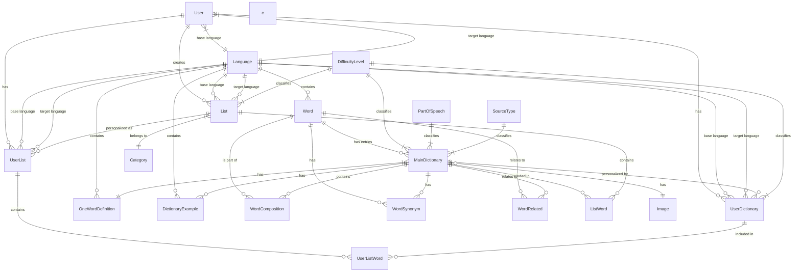

# Database Schema Relationships

## Entity Relationship Diagram

## Table Relationships Description

### Core Entities

- **User**: Central entity managing language learning preferences and content
- **Word**: Base vocabulary items in specific languages
- **MainDictionary**: Core dictionary entries with translations and metadata
- **Language**: Supported languages for learning and content

### Learning Management

- **UserDictionary**: Personalized dictionary entries with learning progress
- **List**: Predefined word lists (e.g., thematic vocabularies)
- **UserList**: Personalized versions of lists with custom settings

### Supporting Entities

- **Image**: Visual representations shared across dictionary entries
- **DictionaryExample**: Usage examples for dictionary entries
- **Category**: Classification for word lists
- **OneWordDefinition**: Concise definitions in specific languages

### Relationship Tables

- **ListWord**: Links words to lists with ordering
- **UserListWord**: Links personalized dictionary entries to user lists
- **WordComposition**: Manages compound words
- **WordSynonym**: Tracks synonymous relationships
- **WordRelated**: Manages related word connections

### Key Features

1. **Multi-language Support**

   - Each user has base and target languages
   - Content is language-specific with translations

2. **Personalization**

   - Users can customize dictionary entries and lists
   - Progress tracking per word and list
   - Custom difficulty levels and learning status

3. **Content Organization**

   - Hierarchical categorization of lists
   - Word relationships (synonyms, related words, compositions)
   - Examples and visual aids

4. **Learning Progress**

   - Tracking of learned words
   - Review scheduling
   - Difficulty assessment
   - Mistake counting

5. **Soft Delete Support**
   - Most entities include `deletedAt` for safe removal

## Performance Considerations

The schema includes strategic indexes for:

- Language-specific queries
- User progress monitoring
- Word search optimization
- Learning status tracking
- List organization
- Image association
